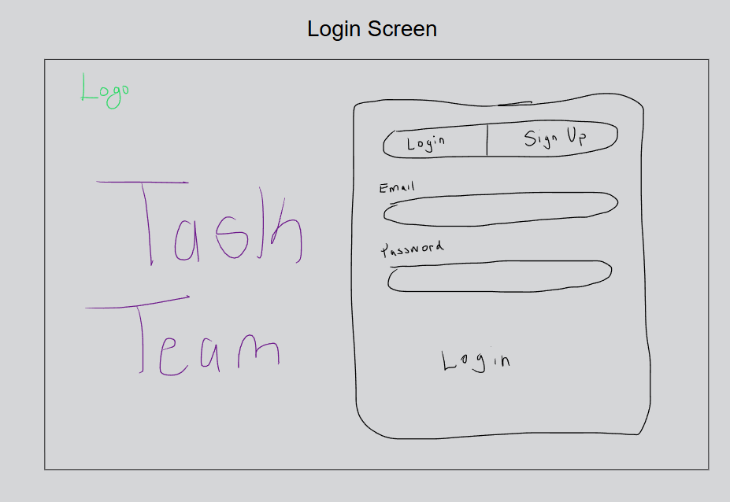
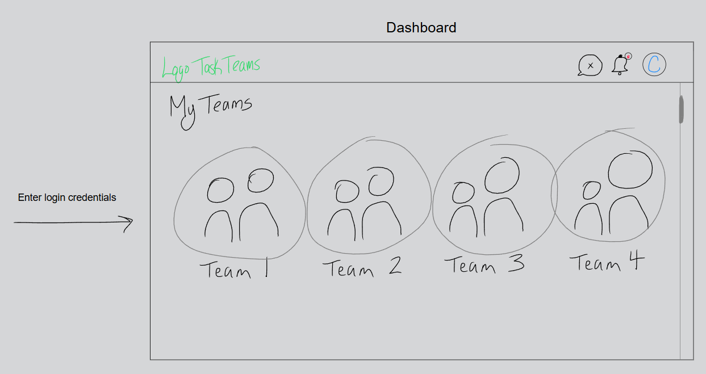
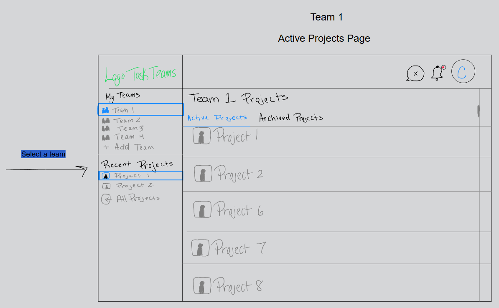
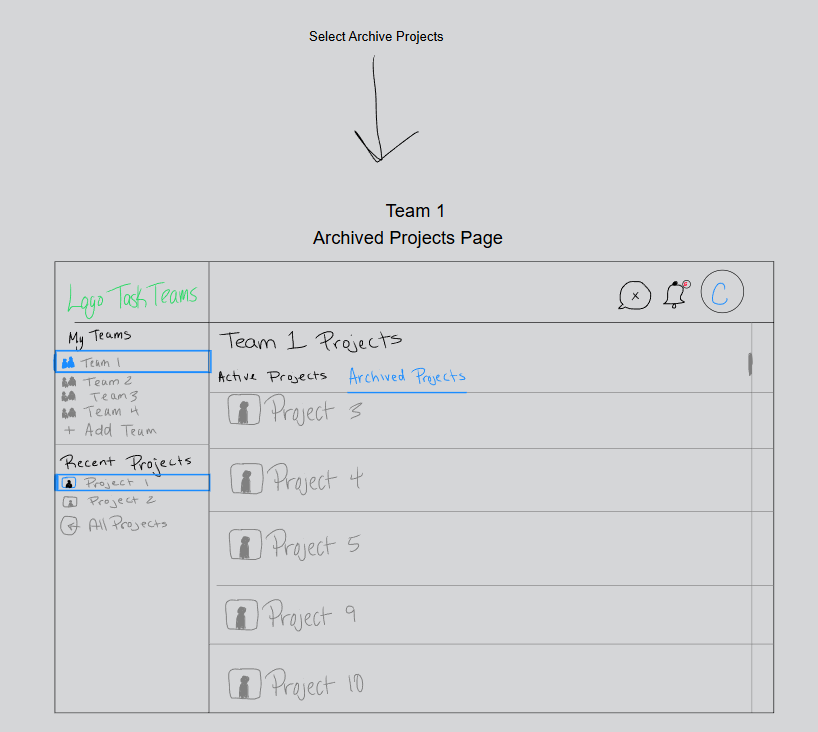
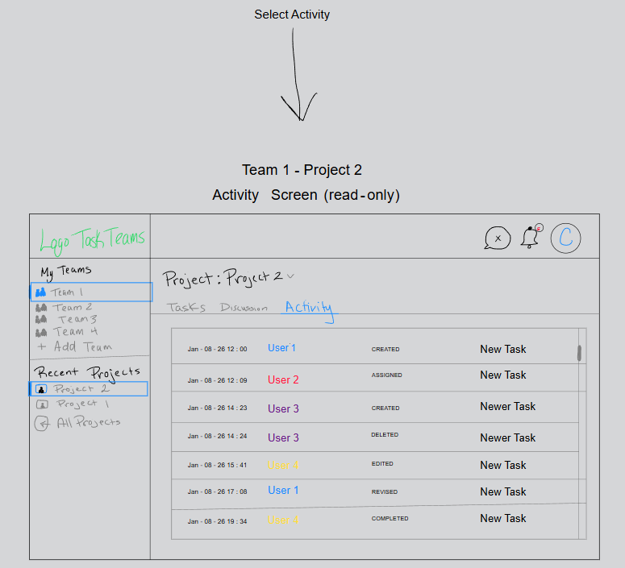
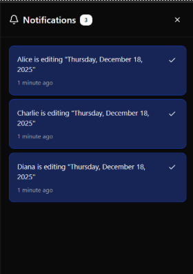

# Wireframes

This document outlines the wireframes created for TaskTeam and the intended user flow between screens.

## Purpose
Wireframes were created to define layout, navigation, and feature placement before development.

## Screens Included
- Login / Sign Up
- Teams Dashboard
- Active and Archived Projects
- Task Board (To Do / In Progress / Done)
- Team Chat
- Project Discussions (Daily Memos, Questions, Discussions, Blockers)
- Activity Feed (read-only)
- Notifications Panel

## Authentication

## Teams Dashboard

## Projects Screen

## Task Board with Team Chat

## Project Discussions

## Activity Feed (read-only)

## Notifications Panel

## View Full Wireframe

[Link to Full Wireframe](https://notes.myscript.com/app/page/a423e6a2-0322-4e88-8e01-732e9cfc5cfe)

## Notes
> The wireframes focus on structure and user
flow rather than final visual design. Styling and animations will be refined during development.